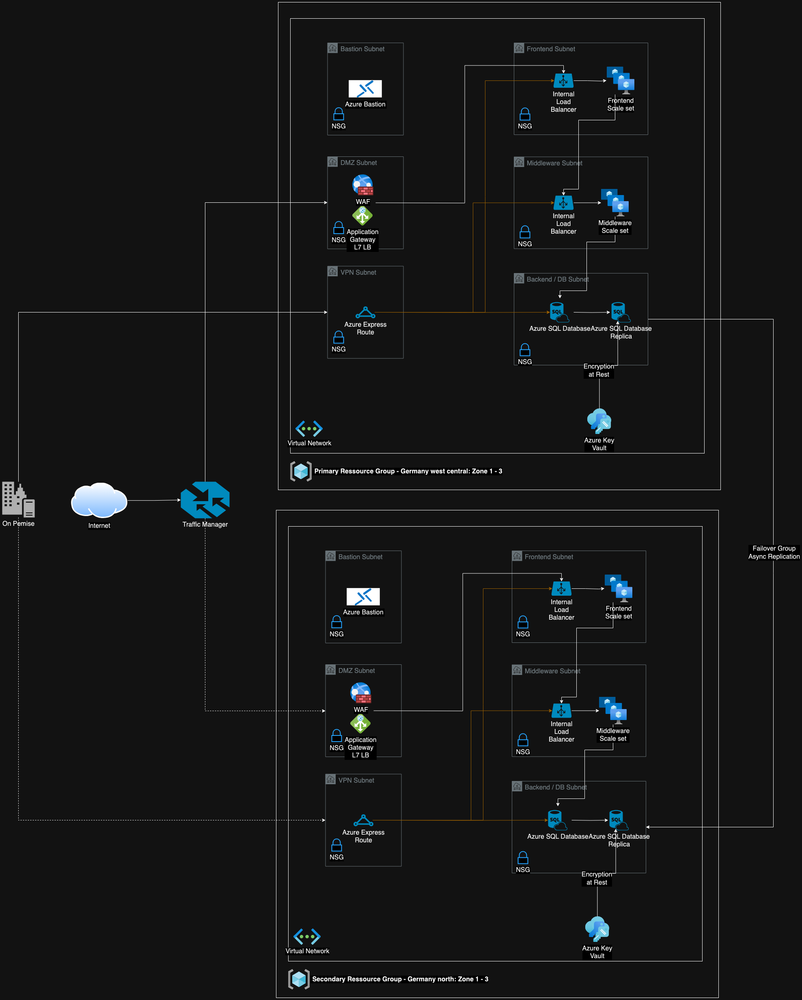

# cloud-architecture

> Sample 3-Tier azure cloud architecture implemented with Pulumi

The goal, is an architecture that satisfies the following requirements:

<!-- TODO: Describe How achieved -->

1. Modularity
2. Scalability
3. High Availability
4. Fault tolerance
5. Security

## Architecture

Components:

1. **Availability Sets** : Increases the availability to reach the given SLAs
2. **Subnets**: Separate the networks
3. **Load Balancers** :
   - _External_ load balancer with public IP to distribute incoming traffic to the Frontend tier.
   - _Internal_ load balancer to distribute frontend traffic to the middleware tier
4. **NSGs / Network security groups** : Restrict network traffic within the virtual network.
   - F.ex: Only the middleware should be able to access the Backend / DB tier
5. **Key Vault** : Store encryption keys to encrypt the replication data at rest
6. **Bastion:** A way to securely access the VMs in the virtual network from the outside

## Practical implementation

> The frontend tier will be used to exemplary showcase the provisioning of the infrastructure.

For this demo, we add two parts which are non azure related:

1. **Sample web application** : React application, which represents a strooongly simplified car part ERP. For the sake of this exercise, we simulate the middleware and backend tier by storing and processing everything in memory.
2. **Pulumi** : IaC-Tool to provision the azure components

## References

- https://learn.microsoft.com/en-us/azure/architecture/guide/architecture-styles/n-tier
- Fork used for the Web Application: https://github.com/daniel-vera-g/crud-app
