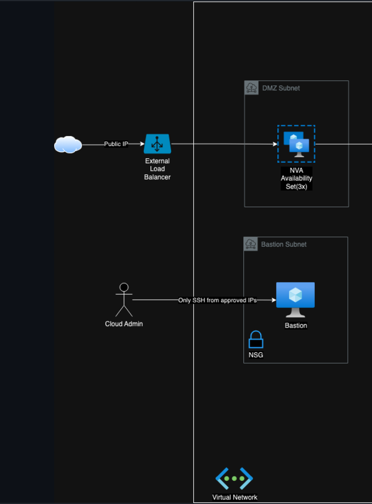

# Provisioning with Pulumi

> The frontend tier will be used to exemplary showcase the provisioning of the infrastructure.

Part of the architecture which gets implemented:

## External tooling

For this demo, we add two parts which are non azure related:

1. **Sample web application** : React application, which represents a strooongly simplified car part ERP. For the sake of this exercise, we simulate the middleware and backend tier by storing and processing everything in memory.
2. **Pulumi** : IaC-Tool to provision the azure components

## References

- Fork used for the Web Application: https://github.com/daniel-vera-g/crud-app
