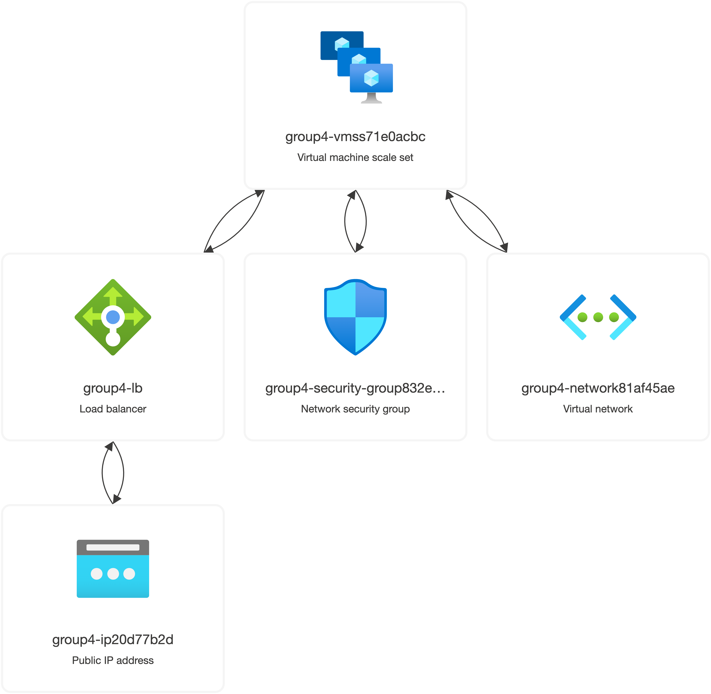

# Provisioning with Pulumi

> The frontend tier will be used to exemplary showcase the provisioning of the infrastructure.

Part of the architecture which gets implemented:

## Get started

1. Set up and configure Azure and Pulumi
2. Edit the config at the beginning of the `index.ts`
3. Start: `pulumi up`
4. Destroy: `pulumi destroy`
